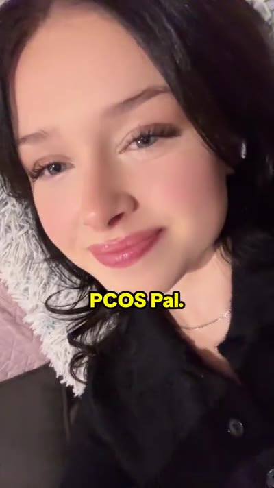

# ReelClaw

UGC reel production engine for AI coding agents. Create scroll-stopping short-form videos at scale.

```
npx skills add dansugc/reelclaw --all
```

## See it in action

A 30-second talking-video produced end-to-end by the `/talking-video` workflow — ElevenLabs voiceover + CapCut-style auto-synced captions + lo-fi music underlay + UGC reactions + app demo cutaways. One JSON spec, one command, one finished MP4.

[](https://pub-70f9e589b1c640b49218874baf1c733f.r2.dev/pcos_04_kris_cycle_60_to_28.mp4)

▶ [**Watch the 30s example →**](https://pub-70f9e589b1c640b49218874baf1c733f.r2.dev/pcos_04_kris_cycle_60_to_28.mp4)

<video src="https://pub-70f9e589b1c640b49218874baf1c733f.r2.dev/pcos_04_kris_cycle_60_to_28.mp4" controls width="320"></video>

*Real output from a 10-video PCOS Pal batch. The same pipeline shipped 20 AiPixo photo-app ads and 20 Ease quit-vaping ads from a single JSON spec each — see the [end-to-end example below](#example--talking-video-end-to-end).*

## What It Does

ReelClaw is an AI agent skill that automates two distinct UGC pipelines:

### Classic reel pipeline (7–15s)

1. **Source hooks** — Search and purchase UGC reaction clips from [DanSUGC](https://dansugc.com)
2. **Analyze demos** — Use Gemini AI to find the best segments in screen recordings
3. **Assemble reels** — FFmpeg-powered editing with text overlays, music, and transitions
4. **Publish** — Schedule to TikTok & Instagram natively via [DanSUGC Posting](https://dansugc.com) using the secure 3-step upload flow (presign → PUT → `create_post`). See [`references/posting-upload.md`](references/posting-upload.md).
5. **Track & replicate** — Monitor performance via DanSUGC's analytics proxy and double down on winners
6. **Format research** — Find viral format ideas in any niche
7. **Hook research** — Discover proven text hooks from high-performing videos

### `/talking-video` workflow (20–30s) *(new)*

8. **Long-form narrated testimonial ads** — ElevenLabs voiceover with **CapCut-style auto-synced captions** (generated from word-level timestamps, not hand-coded), lo-fi music underlay, UGC reactions, and app demo cutaways. One JSON spec → N finished videos in a single run. See [`references/talking-video.md`](references/talking-video.md).

---

## Requirements

| Tool | Required for | Where to get |
|---|---|---|
| **ffmpeg** + **ffprobe** | Both pipelines | `brew install ffmpeg` / `apt install ffmpeg` |
| **DanSUGC API key** | UGC clips, analytics, TikTok/IG posting | [dansugc.com](https://dansugc.com) |
| **Gemini API key** | Demo analysis, virality scoring | [aistudio.google.com](https://aistudio.google.com/apikey) |
| **ElevenLabs API key** | `/talking-video` workflow only — voiceover + word-level timestamps | [elevenlabs.io](https://elevenlabs.io) |
| **yt-dlp** *(optional)* | Downloading TikTok music for `/talking-video` | `brew install yt-dlp` |

> **Heads up on ElevenLabs:** for now the `/talking-video` workflow requires you to set `ELEVENLABS_API_KEY` in your environment. This will soon be integrated into the DanSUGC API so a single DanSUGC key will cover voiceovers too.

---

## Quick Setup

### 1. Install the skill

```bash
npx skills add dansugc/reelclaw --all
```

### 2. Connect MCP servers

```bash
# DanSUGC — UGC reaction clips + analytics + posting (TikTok + Instagram)
claude mcp add --transport http -s user dansugc https://dansugc.com/api/mcp \
  -H "Authorization: Bearer dsk_YOUR_API_KEY"
```

> DanSUGC handles UGC clips, analytics, and posting to TikTok/Instagram. A Posting subscription is required for the publishing step.

### 3. Set environment variables

```bash
# Required for the classic pipeline
export GEMINI_API_KEY="your_gemini_key"

# Required for /talking-video workflow (will be folded into DanSUGC API soon)
export ELEVENLABS_API_KEY="your_11labs_key"
```

You can also persist these in `.env` and source it before running:

```bash
# .env
GEMINI_API_KEY=...
ELEVENLABS_API_KEY=...
```

```bash
set -a; source .env; set +a
```

### 4. Use it

**Classic pipeline** — tell your AI agent:

> "Use ReelClaw to create 5 UGC reels for my app using shocked reaction hooks"
>
> "Find me format ideas for beef liver supplements on TikTok"
>
> "Find hooks for my meditation app"

**Talking-video pipeline** — type `/talking-video` and the agent will:

1. Load `references/talking-video.md` for the full spec
2. Walk you through the requirements checklist (ElevenLabs key, app demos, reaction source, voice/music preferences)
3. Write N scripts using one of 5 proven hook families
4. Fetch reactions from DanSUGC (admin status → direct URLs, otherwise via `purchase_videos`)
5. Produce all videos in one batch via `assets/talking-video/build_talking_video.py`

---

## Example — `/talking-video` end-to-end

> Real run from a quit-vaping app delivery. 20 finished videos in one batch.

**What the user gave us:**
- `demos/` — 10 screen-recording `.mov` files (onboarding, stats, breathing exercise, plan overview, money saved, etc.)
- `ease-hooks.md` — 5 hook families with 20 hook variants each (usage reality, money wasted, craving caught, public commitment, before/after)
- 2 DanSUGC `model_id`s: Alexandros (male) + Anet (female)
- "20 talking videos please"

**What the skill did:**

1. **Loaded the workflow** — read `references/talking-video.md` for the spec, voice library, music recipe, hook family templates, FB compliance rules.

2. **Confirmed requirements with the user**:
   - ✅ `ELEVENLABS_API_KEY` in env
   - ✅ App name: "Ease", CTA: `EASE\non AppStore`
   - ✅ 10 demos (1080×1920 vertical, 7–11s each)
   - ✅ 2 models for reaction variety
   - ✅ 20 videos = 10 per model

3. **Fetched reactions** — DanSUGC search filtered by `model_id` + emotion. Admin status returned `download_url` directly. 39 clips downloaded across shocked / sad / frustrated / calm / happy / determined emotions.

4. **Voice assignment** — male model → Liam (`TX3LPaxmHKxFdv7VOQHJ`); female model → Olivia (`YZHSTqsq1isdXNsFLzBw`). Voice library in `references/talking-video.md`.

5. **Music bed** — reused a pre-baked lo-fi piano bed (`childhood` by daniel & Zamaro), looped + loudness-normalized to −16 LUFS, mixed at 50%.

6. **Wrote 20 scripts** — 4 per hook family, ~75 words each, ending with the standardized CTA. Compliance audit: zero `your [vape|addiction|nicotine|habit]` matches.

7. **Built JSON spec** — `concepts.json` with per-concept timelines (3 reactions → 2 demo cutaways → 1 mid reaction → 1 CTA reaction).

8. **Ran the orchestrator**:

   ```bash
   # First 5 for review (one per hook family)
   ONLY="01,06,11,13,17" python3 assets/talking-video/build_talking_video.py concepts.json

   # Remaining 15 after approval
   ONLY="02,03,04,05,07,08,09,10,12,14,15,16,18,19,20" python3 assets/talking-video/build_talking_video.py concepts.json
   ```

9. **Output** — 20 × 30.000s MP4s, 1080×1920, AAC 192kbps. Each with VO + auto-synced captions + lo-fi music underlay + big yellow CTA card in the last 4s.

**Time to first 5 videos:** ~6 minutes (including reaction fetch + script writing).
**Time to all 20:** ~18 minutes total.

---

## Minimal `concepts.json` example

The full schema lives in [`references/talking-video.md`](references/talking-video.md). A starter is at [`assets/talking-video/concepts_template.json`](assets/talking-video/concepts_template.json). A single concept looks like:

```json
{
  "common": {
    "elevenlabs_api_key": "",
    "model_id": "eleven_multilingual_v2",
    "speed": 1.05,
    "stability": 0.45,
    "similarity_boost": 0.8,
    "style": 0.5,
    "font": "/Users/you/Library/Fonts/TikTokSansDisplayBlack.ttf",
    "demos_dir": "/abs/path/to/demos",
    "reactions_dir": "/abs/path/to/reactions",
    "out_dir": "/abs/path/to/output/myapp_v1",
    "out_prefix": "myapp",
    "music_path": "/abs/path/to/music_bed_30s.mp3",
    "music_volume": 0.5,
    "cta_text": "MYAPP\non AppStore",
    "target_duration": 30.0,
    "cta_reserve": 4.0,
    "emphasis_words": ["myapp", "free", "obsessed"]
  },
  "concepts": [
    {
      "name": "01_deception_linkedin",
      "voice_id": "x8syuETaTA9JYwAbE2JM",
      "voice_name": "Ava",
      "vo_text": "Help, I used MyApp for my LinkedIn and a recruiter replied in two hours...",
      "timeline": [
        {"src": "reactions/model/clip1.mp4", "in": 1.0, "dur": 3.0},
        {"src": "reactions/model/clip2.mp4", "in": 1.0, "dur": 3.0},
        {"src": "reactions/model/clip3.mp4", "in": 0.5, "dur": 3.0},
        {"src": "demos/feature_browser.mov", "in": 1.5, "dur": 6.0},
        {"src": "demos/result_reveal.mov", "in": 2.0, "dur": 6.0},
        {"src": "reactions/model/clip4.mp4", "in": 2.0, "dur": 4.0},
        {"src": "reactions/model/clip5.mp4", "in": 2.0, "dur": 5.0}
      ]
    }
  ]
}
```

Leave `elevenlabs_api_key` empty in the JSON and the script reads from the `ELEVENLABS_API_KEY` env var (recommended — never commit keys to git).

---

## Pre-baking a music bed

The `/talking-video` orchestrator expects the music to already be loudness-normalized so 50% volume means a predictable level. The recipe:

```bash
# Loop any source (even a 7s TikTok clip), normalize to -16 LUFS, fade in
ffmpeg -y -stream_loop -1 -i "SOURCE.mp3" -t 32 \
  -af "loudnorm=I=-16:TP=-1.5:LRA=11,afade=t=in:st=0:d=0.4" \
  -c:a libmp3lame -q:a 2 "music_bed_30s.mp3"
```

Suggested sources (all tested and working under VO):
- **`childhood` — daniel & Zamaro** *(lo-fi piano, default for testimonial content)*
- `Je te laisserai des mots` — Patrick Watson *(emotional/transformation arcs)*
- Any instrumental ≥7s — looper handles the rest

Use `yt-dlp -x --audio-format mp3 "TIKTOK_URL"` to grab music from a TikTok link.

---

## Safe ElevenLabs voices

Listed in [`references/talking-video.md`](references/talking-video.md). All 8 (4 built-in + 4 shared-library) work directly via the standard TTS endpoint with no extra setup. Highlights:

| Name | voice_id | Best for |
|---|---|---|
| Jessica | `cgSgspJ2msm6clMCkdW9` | Playful Gen-Z confessional |
| Aria | `9BWtsMINqrJLrRacOk9x` | Confident results testimonial |
| Olivia | `YZHSTqsq1isdXNsFLzBw` | Smooth, persuasive young female |
| Ava | `x8syuETaTA9JYwAbE2JM` | Energetic UGC, young South African |
| Liam | `TX3LPaxmHKxFdv7VOQHJ` | Energetic young male, social-media creator |
| Daphne | `cR39HTrtXbjvEP4CNYFx` | Sweet, calm, friendly |

---

## How the auto-sync captions work

This is the differentiator vs. hand-timed captions:

1. Call ElevenLabs `/v1/text-to-speech/{voice}/with-timestamps` → returns audio + per-character start/end times
2. Group characters into words (split on whitespace)
3. Group words into 2-3 word phrases (break on punctuation, max 1.1s duration per phrase)
4. After `atempo`-fitting the VO to target duration, divide every phrase timestamp by the same tempo factor
5. Each phrase renders as a `drawtext` filter with `enable='between(t,start,end)'`
6. Big CTA card overlays the last 4s; body captions are capped to end at `video_dur - 4`

Result: captions hit on the exact syllable of the VO, like CapCut auto-captions. No manual timing.

---

## The Pipeline (classic)

```
DanSUGC (hooks + analytics + posting) + Demos (Gemini AI) + Text + Music
    | FFmpeg Assembly (1080x1920, 15s max)
    | DanSUGC Posting (TikTok + Instagram)
    | DanSUGC Analytics Proxy (tracking)
    | Replicate Winners
```

## The Pipeline (`/talking-video`)

```
ElevenLabs VO + char-level timestamps
    | Atempo-fit to target duration (30s)
    | Char alignment -> 2-3 word phrases
    | DanSUGC reactions + app demos -> 7-segment timeline
    | FFmpeg concat
    | drawtext per phrase + big CTA card
    | amix with normalized music bed at 50%
    | H.264 / AAC 192k / faststart
```

## Key Rules

- **15 seconds max** per reel for the classic pipeline (`/talking-video` is exempt — target 20–30s)
- **TikTok Sans font** for all text overlays
- **Green Zone positioning** — text placed only in platform-safe areas
- **One video per account** — unique content per social account
- **Auto-audit `your [attribute]`** — Facebook personal-attributes rule for the `/talking-video` workflow

## Compatible Agents

Works with any agent that supports the Skills format:
- Claude Code
- Cursor
- Cline
- Codex
- Gemini CLI
- Continue
- Windsurf
- OpenCode

## License

MIT
